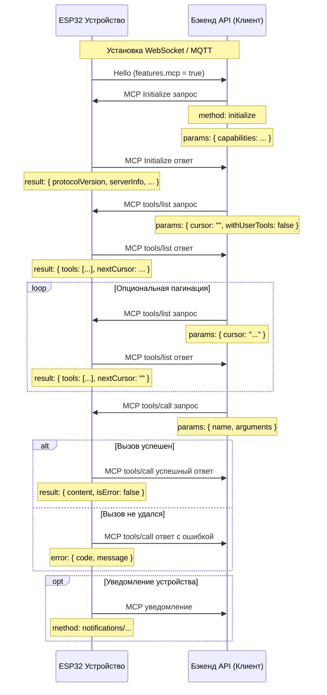

# Поток взаимодействия MCP (Model Context Protocol)

**ВНИМАНИЕ:** Этот документ был создан с помощью ИИ; при реализации бэкенда всегда проверяйте детали по коду.

В этом проекте MCP используется между бэкендом API (клиент MCP) и устройством ESP32 (сервер MCP), чтобы бэкенд мог обнаруживать и вызывать возможности устройства (инструменты).

## Формат сообщений

Из `main/protocols/protocol.cc` и `main/mcp_server.cc`, сообщения MCP оборачиваются внутри
базового транспорта (WebSocket или MQTT). Внутренняя полезная нагрузка следует спецификации
[JSON-RPC 2.0](https://www.jsonrpc.org/specification).

Общий макет сообщения:

```json
{
  "session_id": "...",   // идентификатор сессии
  "type": "mcp",         // фиксированное значение "mcp"
  "payload": {           // полезная нагрузка JSON-RPC 2.0
    "jsonrpc": "2.0",
    "method": "...",     // имя метода ("initialize", "tools/list", "tools/call", ...)
    "params": { ... },   // аргументы (для запросов)
    "id": ...,           // идентификатор запроса (для запросов и ответов)
    "result": { ... },   // результат успеха (ответ)
    "error": { ... }     // ошибка (ответ)
  }
}
```

Поле `payload` следует стандартному JSON-RPC 2.0:

- `jsonrpc`: всегда `"2.0"`.
- `method`: имя метода (запросы).
- `params`: структурированные параметры, обычно объект (запросы).
- `id`: идентификатор запроса; возвращается в ответах.
- `result`: результат успеха (ответы).
- `error`: информация об ошибке (ответы).

## Поток взаимодействия

Взаимодействия MCP инициируются клиентом (бэкендом), который обнаруживает и вызывает инструменты на устройстве.

1. **Подключение и объявление возможностей**

   - **Когда**: после загрузки устройства и подключения к бэкенду.
   - **Направление**: устройство -> бэкенд.
   - **Сообщение**: устройство отправляет hello транспорта, рекламируя поддерживаемые возможности. Поддержка MCP сигнализируется через `"mcp": true` в карте `features`.
   - **Пример (hello транспорта, не MCP-полезная нагрузка):**
     ```json
     {
       "type": "hello",
       "version": 1,
       "features": {
         "mcp": true
       },
       "transport": "websocket",
       "audio_params": { ... },
       "session_id": "..."
     }
     ```

2. **Инициализация сессии MCP**

   - **Когда**: после того, как бэкенд видит, что устройство поддерживает MCP. Обычно первый запрос MCP.
   - **Направление**: бэкенд -> устройство.
   - **Метод**: `initialize`
   - **Сообщение (MCP-полезная нагрузка):**
     ```json
     {
       "jsonrpc": "2.0",
       "method": "initialize",
       "params": {
         "capabilities": {
           // необязательные возможности клиента
           "vision": {
             "url": "...",   // конечная точка загрузки изображения с камеры (должен быть http URL, не websocket URL)
             "token": "..."  // токен для URL загрузки
           }
           // ... другие возможности клиента
         }
       },
       "id": 1
     }
     ```

   - **Ответ устройства:**
     ```json
     {
       "jsonrpc": "2.0",
       "id": 1,
       "result": {
         "protocolVersion": "2024-11-05",
         "capabilities": {
           "tools": {}
         },
         "serverInfo": {
           "name": "...",    // имя устройства (BOARD_NAME)
           "version": "..."  // версия прошивки
         }
       }
     }
     ```

3. **Обнаружение инструментов**

   - **Когда**: всякий раз, когда бэкенду нужно список вызываемых инструментов и их сигнатур.
   - **Направление**: бэкенд -> устройство.
   - **Метод**: `tools/list`
   - **Параметры запроса**:
     - `cursor` (string, необязательно): курсор пагинации. Пусто в первом запросе.
     - `withUserTools` (boolean, необязательно, по умолчанию `false`): если `true`, устройство также включает «пользовательские» инструменты (см. ниже) в список. Обычно используется приложением-компаньоном, которое позволяет пользователю инициировать привилегированные действия.
   - **Сообщение (MCP-полезная нагрузка):**
     ```json
     {
       "jsonrpc": "2.0",
       "method": "tools/list",
       "params": {
         "cursor": "",
         "withUserTools": false
       },
       "id": 2
     }
     ```
   - **Ответ устройства:**
     ```json
     {
       "jsonrpc": "2.0",
       "id": 2,
       "result": {
         "tools": [
           {
             "name": "self.get_device_status",
             "description": "...",
             "inputSchema": { ... }
           },
           {
             "name": "self.audio_speaker.set_volume",
             "description": "...",
             "inputSchema": { ... }
           }
           // ... больше инструментов
         ],
         "nextCursor": "..."
       }
     }
     ```
   - **Пагинация**: когда `nextCursor` непуст, бэкенд должен отправить ещё один запрос `tools/list` с этим курсором для получения следующей страницы.

4. **Вызов инструмента**

   - **Когда**: бэкенд хочет выполнить конкретную функцию устройства.
   - **Направление**: бэкенд -> устройство.
   - **Метод**: `tools/call`
   - **Сообщение (MCP-полезная нагрузка):**
     ```json
     {
       "jsonrpc": "2.0",
       "method": "tools/call",
       "params": {
         "name": "self.audio_speaker.set_volume",
         "arguments": {
           "volume": 50
         }
       },
       "id": 3
     }
     ```
   - **Успешный ответ:**
     ```json
     {
       "jsonrpc": "2.0",
       "id": 3,
       "result": {
         "content": [
           { "type": "text", "text": "true" }
         ],
         "isError": false
       }
     }
     ```
   - **Ответ с ошибкой:**
     ```json
     {
       "jsonrpc": "2.0",
       "id": 3,
       "error": {
         "code": -32601,
         "message": "Unknown tool: self.non_existent_tool"
       }
     }
     ```

5. **Уведомления, инициированные устройством**

   - **Когда**: устройство хочет сообщить бэкенду о внутренних событиях (например, переходах состояний). `Application::SendMcpMessage` — исходная точка для исходящих сообщений.
   - **Направление**: устройство -> бэкенд.
   - **Метод**: по соглашению `notifications/...` или любой кастомный метод.
   - **Сообщение (MCP-полезная нагрузка)**: уведомления JSON-RPC не имеют `id`.
     ```json
     {
       "jsonrpc": "2.0",
       "method": "notifications/state_changed",
       "params": {
         "newState": "idle",
         "oldState": "connecting"
       }
     }
     ```
   - **Обработка бэкендом**: обрабатывайте уведомление без ответа.

## Пользовательские инструменты

Сервер MCP на устройстве поддерживает два типа инструментов:

- **Обычные инструменты** — регистрируются через `McpServer::AddTool`. Доступны бэкенду (и, следовательно, ИИ) по умолчанию.
- **Пользовательские инструменты** — регистрируются через `McpServer::AddUserOnlyTool`. Скрыты от стандартных ответов `tools/list`, так как являются привилегированными или ориентированными на пользователя действиями, которые не должны вызываться автономно ИИ. Примеры: перезагрузка системы, обновление прошивки, загрузка снимка экрана.

Бэкенд включает пользовательские инструменты, отправив `tools/list` с `params.withUserTools = true`. Типичное использование: экран приложения-компаньона, который предоставляет эти действия конечному пользователю.

См. [Использование MCP для IoT-управления](./mcp-usage.md), как зарегистрировать любой тип инструмента на стороне устройства.

## Диаграмма последовательности

Упрощённая диаграмма основного потока сообщений MCP:



Этот документ кратко описывает поток взаимодействия MCP в этом проекте. Для точных параметров,
поведения и доступных инструментов обращайтесь к `McpServer::AddCommonTools` / `AddUserOnlyTools`
в `main/mcp_server.cc` и реализациям `InitializeTools` для каждой платы.