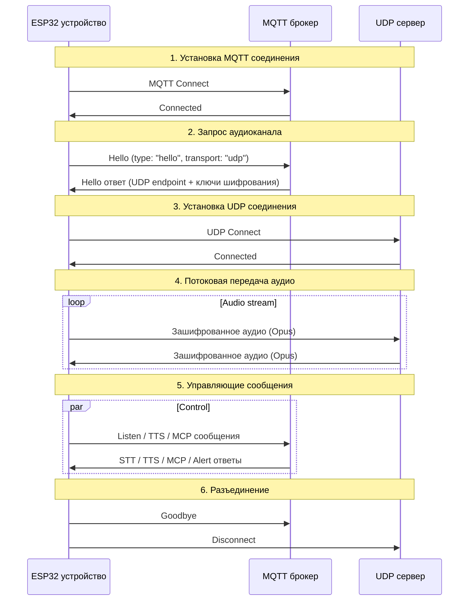
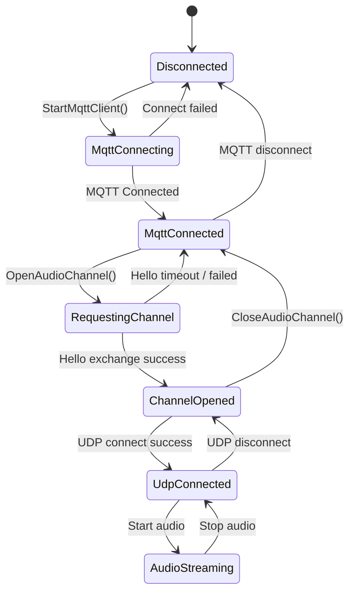

# Гибридный протокол MQTT + UDP

Этот документ описывает гибридный протокол MQTT + UDP, используемый между устройством и сервером,
основанный на текущей реализации: MQTT несёт управляющие сообщения, UDP — аудио в реальном времени.

---

## 1. Обзор

Протокол использует два канала:

- **MQTT** — управляющие сообщения, синхронизация состояний, JSON-полезные данные.
- **UDP** — аудио в реальном времени, зашифрованное.

### 1.1 Ключевые особенности

- **Двухканальный дизайн** — управление отделено от данных, чтобы аудио имело низкую задержку.
- **Шифрование транспорта** — UDP-аудио шифруется AES-CTR.
- **Номера последовательности** — защита от повторного воспроизведения и переупорядочивания.
- **Автоматическое переподключение** — MQTT переподключается при разъединении.

---

## 2. Поток передачи данных



---

## 3. Управляющий канал MQTT

### 3.1 Подключение

Устройство подключается к брокеру с помощью:
- **Endpoint** — хост и порт брокера.
- **Client ID** — идентификатор устройства.
- **Username / Password** — учётные данные.
- **Keep Alive** — интервал heartbeat (по умолчанию 240 с).

### 3.2 Обмен hello

#### 3.2.1 Устройство -> Сервер

```json
{
  "type": "hello",
  "version": 3,
  "transport": "udp",
  "features": {
    "mcp": true,
    "aec": true,
    "glyph_push": true
  },
  "text_font": {
    "bundle": "noto-v1",
    "charset": "common",
    "size": 20,
    "bpp": 4
  },
  "audio_params": {
    "format": "opus",
    "sample_rate": 16000,
    "channels": 1,
    "frame_duration": 60
  }
}
```

`features.mcp` всегда установлен; `features.aec` установлен, когда включён `CONFIG_USE_SERVER_AEC`.
`features.glyph_push` и `text_font` рекламируют общее расширение динамической подачи глифов текста,
описанное в [Расширении динамической подачи глифов текста](glyph-push.md).

#### 3.2.2 Сервер -> Устройство

```json
{
  "type": "hello",
  "transport": "udp",
  "session_id": "xxx",
  "audio_params": {
    "format": "opus",
    "sample_rate": 24000,
    "channels": 1,
    "frame_duration": 60
  },
  "udp": {
    "server": "192.168.1.100",
    "port": 8888,
    "key": "0123456789ABCDEF0123456789ABCDEF",
    "nonce": "0123456789ABCDEF0123456789ABCDEF"
  }
}
```

Ссылка на поля:
- `udp.server` — адрес UDP-сервера.
- `udp.port` — порт UDP-сервера.
- `udp.key` — ключ AES, в hex-кодировке.
- `udp.nonce` — nonce AES, в hex-кодировке.

### 3.3 Типы JSON-сообщений

#### 3.3.1 Устройство -> Сервер

1. **Listen**
   ```json
   {
     "session_id": "xxx",
     "type": "listen",
     "state": "start",
     "mode": "manual"
   }
   ```

2. **Abort**
   ```json
   {
     "session_id": "xxx",
     "type": "abort",
     "reason": "wake_word_detected"
   }
   ```

3. **MCP**
   ```json
   {
     "session_id": "xxx",
     "type": "mcp",
     "payload": {
       "jsonrpc": "2.0",
       "id": 1,
       "result": {}
     }
   }
   ```

4. **Goodbye**
   ```json
   {
     "session_id": "xxx",
     "type": "goodbye"
   }
   ```

#### 3.3.2 Сервер -> Устройство

Семантика совпадает с протоколом WebSocket. Поддерживаемые типы:
- **STT** — результат распознавания речи.
- **TTS** — жизненный цикл TTS (`start`, `stop`, `sentence_start`).
- **LLM** — обновление эмоции для UI.
- **MCP** — IoT-управление.
- **System** — системное управление, например `"command": "reboot"`.
- **Alert** — показ оповещения в UI; поля: `status`, `message`, `emotion`.
- **Goodbye** — инициированное сервером завершение аудиосессии. Устройство закрывает UDP-канал без отправки собственного goodbye.
- **Custom** (необязательно, включается через `CONFIG_RECEIVE_CUSTOM_MESSAGE`).

Пример оповещения:
```json
{
  "session_id": "xxx",
  "type": "alert",
  "status": "Warning",
  "message": "Battery low",
  "emotion": "sad"
}
```

---

## 4. UDP-канал аудио

### 4.1 Установка канала

После получения ответа hello MQTT устройство:
1. Разбирает хост и порт UDP.
2. Разбирает ключ и nonce AES.
3. Инициализирует контекст AES-CTR.
4. Открывает UDP-сокет.

### 4.2 Формат аудиопакета

#### 4.2.1 Зашифрованный аудиопакет

```
|type 1B|flags 1B|payload_len 2B|ssrc 4B|timestamp 4B|sequence 4B|
|payload payload_len bytes|
```

Ссылка на поля:
- `type`: тип пакета, всегда `0x01`.
- `flags`: флаги, в данный момент не используются.
- `payload_len`: длина полезной нагрузки (в сетевом порядке байт).
- `ssrc`: идентификатор источника синхронизации.
- `timestamp`: временная метка (в сетевом порядке байт).
- `sequence`: номер последовательности (в сетевом порядке байт).
- `payload`: зашифрованные данные аудио Opus.

#### 4.2.2 Шифрование

Использует **AES-CTR** с:
- **Ключ**: 128-битный, предоставляется сервером.
- **Nonce**: 128-битный, предоставляется сервером.
- **Счётчик**: построен из временной метки и номера последовательности.

### 4.3 Управление номерами последовательности

- **Отправитель**: `local_sequence_` увеличивается монотонно.
- **Получатель**: `remote_sequence_` проверяет непрерывность.
- **Антиповтор**: пакеты с номерами меньше ожидаемого сбрасываются.
- **Терпимость**: небольшие разрывы логируются как предупреждения, но всё ещё принимаются.

### 4.4 Обработка ошибок

1. **Ошибка дешифрования** — залогировать ошибку и сбросить пакет.
2. **Разрыв последовательности** — залогировать предупреждение, продолжить обработку пакета.
3. **Некорректный пакет** — залогировать ошибку и сбросить.

---

## 5. Управление состояниями

### 5.1 Состояние соединения



### 5.2 Проверка состояния

Устройство определяет доступность аудиоканала с помощью:
```cpp
bool IsAudioChannelOpened() const {
    return udp_ != nullptr && !error_occurred_ && !IsTimeout();
}
```

---

## 6. Параметры конфигурации

### 6.1 Настройки MQTT

Читаются из хранилища:
- `endpoint` — адрес брокера.
- `client_id` — идентификатор клиента.
- `username` — имя пользователя.
- `password` — пароль.
- `keepalive` — интервал keep-alive (по умолчанию 240 с).
- `publish_topic` — тема публикации.

### 6.2 Аудиопараметры

- **Формат**: Opus
- **Частота дискретизации**: 16 кГц устройство / 24 кГц сервер
- **Каналы**: 1 (моно)
- **Длительность кадра**: 60 мс

---

## 7. Обработка ошибок и переподключение

### 7.1 Переподключение MQTT

- Автоматическая повторная попытка при ошибке подключения.
- Необязательная отчётность об ошибках.
- Очистка выполняется при отключении.

### 7.2 UDP-соединение

- Нет автоматических повторных попыток; зависит от повторного переговора через MQTT.
- Состояние можно запросить в любой момент.

### 7.3 Таймауты

Базовый класс `Protocol` предоставляет обнаружение таймаутов:
- Таймаут по умолчанию: 120 с.
- Основан на времени с момента последнего пакета.
- После таймаута канал помечается как недоступный.

---

## 8. Безопасность

### 8.1 Шифрование транспорта

- **MQTT**: поддерживает TLS/SSL (порт 8883).
- **UDP**: AES-CTR для аудиополезных данных.

### 8.2 Аутентификация

- **MQTT**: имя пользователя / пароль.
- **UDP**: ключи распределяются через MQTT-канал.

### 8.3 Защита от повторного воспроизведения

- Монотонно возрастающие номера последовательности.
- Устаревшие пакеты сбрасываются.
- Временные метки проверяются.

---

## 9. Замечания по производительности

### 9.1 Параллелизм

Мьютекс защищает UDP-соединение:
```cpp
std::lock_guard<std::mutex> lock(channel_mutex_);
```

### 9.2 Управление памятью

- Сетевые объекты создаются и уничтожаются динамически.
- Аудиопакеты управляются умными указателями.
- Контексты шифрования освобождаются немедленно.

### 9.3 Сетевые оптимизации

- Повторное использование UDP-соединения.
- Разумные размеры пакетов.
- Проверка непрерывности последовательности.

---

## 10. Сравнение с WebSocket

| Функция | MQTT + UDP | WebSocket |
|---------|------------|-----------|
| Управляющий канал | MQTT | WebSocket |
| Аудиоканал | UDP (зашифрованный) | WebSocket (бинарный) |
| Задержка | Низкая (UDP) | Средняя |
| Надёжность | Средняя | Высокая |
| Сложность | Высокая | Низкая |
| Шифрование | AES-CTR | TLS |
| Дружелюбие к файрволу | Низкое | Высокое |

---

## 11. Замечания по развёртыванию

### 11.1 Сеть

- Обеспечьте доступность UDP-портов.
- Настройте правила файрвола соответственно.
- Планируйте обход NAT при необходимости.

### 11.2 Серверная инфраструктура

- Конфигурация MQTT-брокера.
- Развёртывание UDP-сервера.
- Управление ключами.

### 11.3 Мониторинг

- Процент успешных подключений.
- Задержка передачи аудио.
- Потеря пакетов.
- Ошибки дешифрования.

---

## 12. Краткое содержание

Гибридный протокол MQTT + UDP обеспечивает эффективную аудиосвязь благодаря:

- **Разделённой архитектуре** — отдельные управляющие и данные каналы с чёткими обязанностями.
- **Шифрованию** — AES-CTR защищает аудиополезные данные.
- **Управлению последовательностью** — предотвращает повторное воспроизведение и переупорядочивание.
- **Автоматическому восстановлению** — MQTT переподключается при сбое.
- **Производительности** — UDP поддерживает низкую задержку аудио.

Протокол хорошо подходит для голосового взаимодействия с низкой задержкой, ценой более высокой сетевой сложности по сравнению с чистым WebSocket.